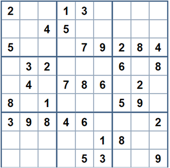
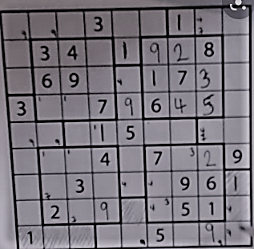
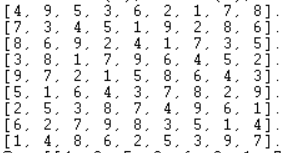

# Matis TÉCHER 

# Irregular_sudoku
This is a final work for the subject Knowledge Representation.

I choose to solve an irregular sudoku.

***What is a sudoku?***

Sudoku is a logic-based, combinatorial number-placement puzzle. The aim of this game is to fill the 9x9 grid with as conditions : each rows, each coloumns and each 3x3 subgrid (also called 'blocks') contains all the digit from 1 to 9. The grid is partially filled with some numbers to help us finding the logical result. The sudoku has only one solution.

*example :*

***How to solve this problem?***

I choosed to use "SWI-Prolog" which is a free Prolog environment and a logic programming language associated with artificial intelligence and computational linguistics. To understand how to code in this language you can use "The Power of Prolog"(https://www.metalevel.at/prolog). This is an online book of Markus Triska. 

***reasoning of the code sudokuexam.pl***

I took an example of irregular sudoku which is the one below:

I needed to use a library named clpfd by using the command ":- use_module(library(clpfd))" that will allow us to use the all_distinct command for example which is an important command in the case of the sudoku.

The first thing to do is to create the sudoku grid with 9 rows and 9 columns (We used the "lentgh" and the maplist command). Then we have to specify that the elements in the grid can only be between 1 and 9. As for the normal sudoku, each elements following a row or a column have to be distinct (for this we use the combination of "maplist" and "all_disctinct" command). However, unlike the normal sudoku, blocks are not regular 3x3 subgrid so we have to define the irregular blocks as in the example above where elements of each blocks also have to be distinct (I used the "all_distinct" command for each blocks).

Finally I recreated the irregular sudoku on prolog giving it the name "sudoku1". And to solve it you need to use the command below directly on SWI-Prolog:

sudoku1(S), sudoku(S), maplist(label, S), maplist(portray_clause, S).

that gives you this result:

