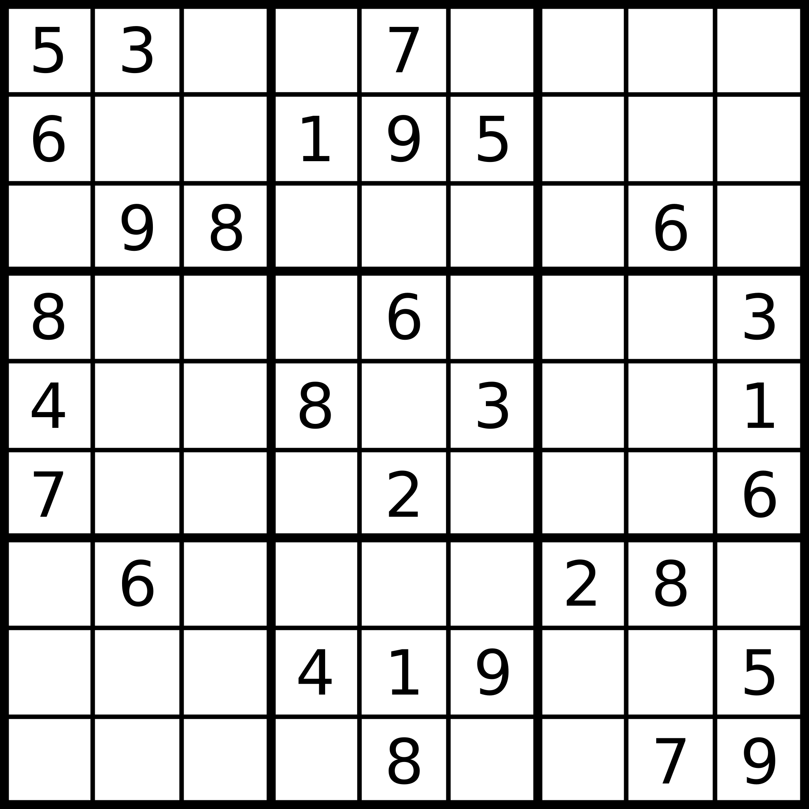

# Matis TÉCHER 

# Irregular_sudoku
This is a final work for the subject Knowledge Representation

***What is a sudoku?***

Sudoku is a logic-based, combinatorial number-placement puzzle. The aim of this game is to fill the 9x9 grid with as conditions : each rows, each coloumns and each 3x3 subgrid (also called 'blocks') contains all the digit from 1 to 9. The grid is partially filled with some numbers to help us finding the logical result. The sudoku has only one solution.

*example :*

